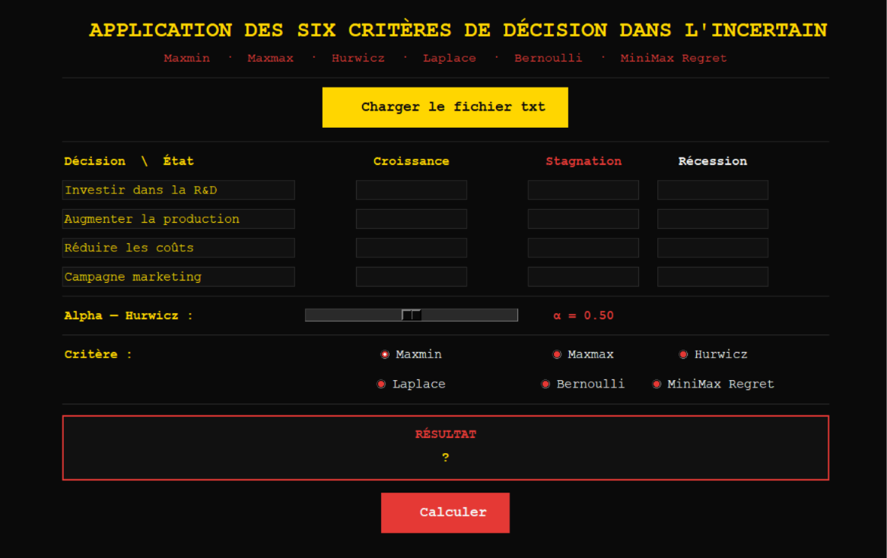

# 🎲 Decision-Making Under Uncertainty (GUI Suite)

> **Interface graphique interactive pour l'évaluation et la visualisation des critères fondamentaux de prise de décision dans l'incertain.**

> **N.B. :** Le fichier PDF téléversé (`docs/Rapport_Réseau_Bayésien.pdf`) contient l'intégralité des outputs de l'implémentation, l'explication détaillée des résultats, les graphes du réseau ainsi que les distributions de probabilités pour chaque scénario d'inférence.

---

## 📸 Aperçu de l'Interface

---

## 📌 Présentation du Projet

Dans les situations de prise de décision où les probabilités des états de la nature sont inconnues, plusieurs stratégies de décision existent. Cette application propose une suite complète permettant de saisir ou d'importer une matrice de gains (4 décisions × 3 états de la nature) et d'appliquer instantanément **6 critères décisionnels** fondamentaux. 

L'outil intègre également un moteur de rendu graphique d'**Arbre de Décision** qui met en valeur la branche optimale sélectionnée ainsi que les gains associés à chaque état.

---

## 🛠️ Critères Incorposés

1. **Maxmin (Pessimiste / Wald)** : Maximise le gain minimal (sécurité maximale dans le pire des cas).
2. **Maxmax (Optimiste)** : Maximise le gain maximal potentiel.
3. **Hurwicz (Compromis)** : Pondère le meilleur et le pire résultat via un coefficient d'optimisme $\alpha \in [0, 1]$ réglable dynamiquement.
4. **Laplace (Principe de raison insuffisante)** : Calcule la moyenne arithmétique des gains en considérant les états équiprobables.
5. **Bernoulli (Utilité logarithmique)** : Évalue la moyenne des utilités $\ln(x)$ pour modéliser l'aversion au risque (exige des valeurs strictement positives).
6. **MiniMax Regret (Savage)** : Minimise le regret maximal potentiel par rapport à la meilleure décision a posteriori.

---

## ✨ Fonctionnalités Clés

* **Import Automatique** : Chargement de matrices personnalisées via fichier texte (`.txt`).
* **Visualisation Dynamique** : Arbre de décision généré sur un `Canvas` Tkinter mettant en évidence l'option retenue.
* **Réglage en temps réel** : Curseur intéractif pour ajuster le paramètre $\alpha$ de Hurwicz.

---

## 🚀 Installation & Lancement

### Prérequis
* Python 3.8+
* NumPy
